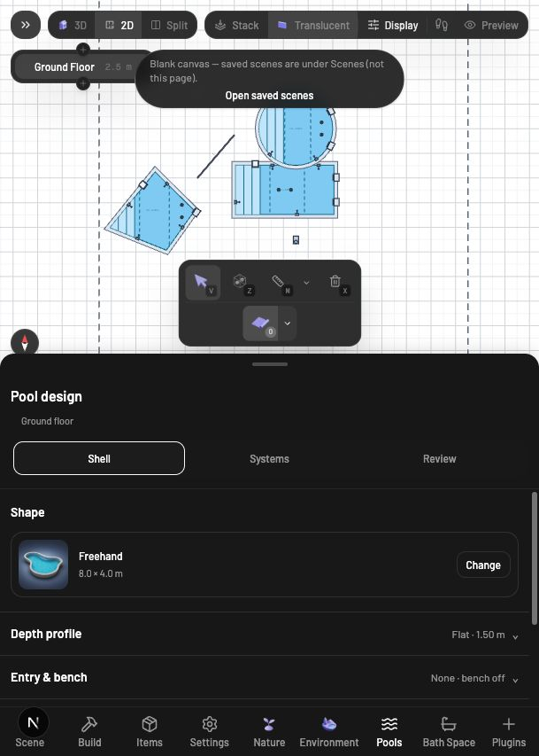
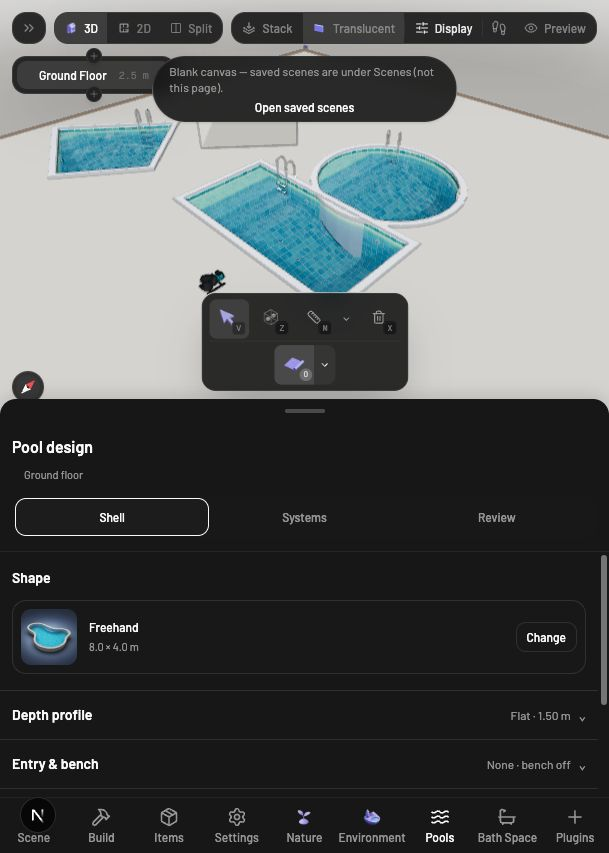

# Pool repair verification

Implemented 2026-10-05 in the local `packages/pool` package. The neighboring editor remains on `plugin-testing`, HEAD `9a3723965`, at http://localhost:3002. Its Pool dependency points to this workspace. The package workspace remains on `main`; no editor branch switch or commit was made.

## Repaired findings

| Original finding | Change | Verification |
| --- | --- | --- |
| Missing component symbols | Added plan builders for skimmers, inlets, drains, ladders, waterfalls, pumps, filters, heaters, valves and shared joints. Symbols resolve pool attachments and positional ancestors. | All twelve registered definitions produce finite geometry; live pump and inlet/skimmer selection works in 2D. |
| Spillover at the wrong origin | Kept modern connection endpoints in scene coordinates; transformed legacy local endpoints into the plan frame. | Regression tests cover translated connections and rotated legacy poses. |
| Freehand restricted to canvas | Accepted the floorplan SVG, mapped pointerdown through its screen matrix, and tracked stroke ownership through release and cancellation. | The actual tool handlers pass SVG and canvas stroke, cancellation, unrelated-pointer release and automatic-closure tests. A live straight SVG drag was exercised; a full closed curved stroke was not manually traced. |
| Missing basin details and incorrect coping width | Used the assembly's real coping outline; added entry footprints and edges, beach-entry indication, bench fronts, slope stations and depth labels. Shared clipping and boundary-bench sampling with the 3D geometry. | Live steps and slope indicators now appear; tests cover all preset/drawn shape frames, curved/concave details, actual coping bounds and waterfall pond dimensions. |
| Shape-picker selection mismatch | Used the selected settings shape for pressed state and card styling. | Live rectangle selection shows Rectangle selected even after choosing a different drawing preset. |
| Panel invalid-hook test | Mocked the outline-control hook in the isolated panel test. | Shell/Systems/Review navigation test passes. |
| Missing package documentation | Added README, contributor/context/change/security files and architecture, node, API, testing and documentation index pages. | Documentation and artifact checks pass. |

Added a Pool-specific plan move session for skimmers, inlets, drains and ladders. The generic host mover writes a free position, which would bypass their attachment anchors. The session previews through live overrides and commits the mounted child pose once. Tests cover rotated parent pools, no scene writes during preview, drain floor-anchor updates, and rejection outside the basin.

## Final automated checks

| Check | Result |
| --- | --- |
| `bun test` | 998 pass, 0 fail across 86 files |
| `bun run check-types` | Pass |
| `bun run check-architecture` | Pass |
| `bun run check-docs` | Pass; 10 Markdown files, 50 code-backed values |
| `bun run build` | Pass |
| `bun run check-package` | Pass; twelve registered node kinds and consumer TypeScript validation |

The sequential `verify` command reached packaging and stopped on the sandbox's npm-cache restriction. The package check was then run successfully with approved cache access. The final individual checks above include the later fitting-move change.

Live comparison of the existing unsaved test scene confirms that procedural pools, entry steps and equipment still render in 3D while the 2D view now displays their symbols and basin details. No error-level browser messages were captured during that comparison. End-to-end movement of every component, a manually traced closed freehand stroke, every plumbing/export combination, XR and long-running water animation have not been visually certified.

The original [verification report](report.md) records the pre-repair behavior and remains historical evidence. Unrelated Bath Space, Landscape and root-lockfile changes were preserved.

## Comparison screenshots

