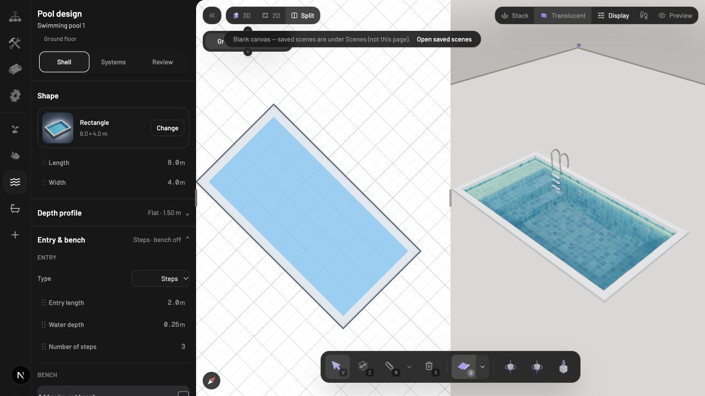
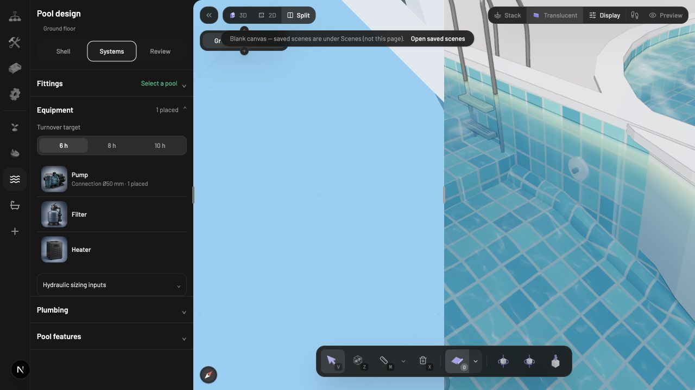

# Pool implementation verification

Repair status as of 2026-10-05: see [implemented fixes and final checks](fixes.md). The findings below describe the original verification before those changes.

Verified 2026-10-02 against the neighboring editor on `plugin-testing` (HEAD `9a3723965`) at http://localhost:3002. The editor was already running. Its app-level Pool dependency is symlinked to this workspace's `packages/pool`, on `main` (HEAD `11d9806`). Both workspaces contain pre-existing unrelated changes. No implementation files were changed.

## Result

The tested 3D shell renders successfully, and preset/custom pool placement can originate in 2D. The two views do not have full visual or interaction parity. The existing automated suite is extensive, but verification is not fully green.

## Findings

1. **High: most Pool components have no 2D representation.** Only the main pool and spillover register a `floorplan` builder. Skimmers, inlets, drains, ladders, waterfalls, pump, filter, heater, valve, and shared joints do not. The editor's floorplan registry skips definitions without that builder (`../editor/packages/editor/src/components/editor-2d/renderers/floorplan-registry-layer.tsx:1069`). Live: the default pool contains two skimmers, four inlets, two drains, and one ladder; the 2D view displays only the basin outline. A pump placed by clicking the 2D grid increments the equipment count and renders in 3D, but has no 2D symbol. These components consequently cannot be picked through their own geometry in the 2D plan.

2. **High: spillover coordinates are incorrect in 2D.** `src/spillover/core/definition.ts:14` converts the scene-space connection endpoints to node-local coordinates, then returns them without a group transform. Ordinary level-child floorplan builders must output level coordinates; the host does not automatically apply the node pose. Reproduction: position `[10,0,20]`, yaw `0`, path `[[9,20],[11,20]]` produces a line from `[-1,0]` to `[1,0]`. It should remain at `[9,20]` to `[11,20]`. This is a code-level reproduction, not a completed live spillover-placement test.

3. **High: Freehand cannot start in the 2D SVG view.** `src/editor/tool.tsx:440` rejects pointerdown unless the target is an `HTMLCanvasElement`. Freehand's grid-click handler also returns immediately. The host emits grid events from SVG and has no Pool-specific freehand adapter. A live 2D drag did not create a draft/pool; the source explains the restriction. The same handler supports drawing on the 3D canvas. Custom click-by-click polygons do work in 2D.

4. **Medium: 2D omits important basin details and understates coping.** `src/core/definition.ts:418` returns one filled path, plus selection/outline-edit controls. Entry steps, tanning shelves, benches, beach entries, and floor-profile indications are absent. Live: adding three entry steps and switching to a 1.10–2.00 m sloped floor changes the 3D basin while the 2D fill stays unchanged. Coping is a centered stroke capped at `0.25 m`; 3D uses an outward offset based on the real coping width (and a minimum tied to shell thickness). A default `0.30 m` coping therefore is not represented to its actual footprint in the plan.

5. **Low: the shape picker highlights the draft rather than the selected pool.** `src/editor/shell-settings.tsx:184` uses `draft.shape` for its pressed state and styling. Live: after creating a circle, selecting the existing rectangle shows the Rectangle card but highlights Circular in the expanded picker. The picker actions start a new pool, so the UI mixes the current selection with the next drawing preset.

6. **Verification test failure:** `src/editor/panel.test.ts` calls the component directly with mocked hooks but does not mock `usePoolOutlineControls()`, now called at `src/editor/panel.tsx:15`. That Zustand hook reaches real React hooks outside a render and throws an invalid-hook-call error. Live Shell → Systems → Review navigation works; the failure is in the test harness.

7. **Packaging/documentation failures:** documentation checking reports missing node/shape/finish documentation in `docs/node-reference.md`; package checking fails because the package is missing `README.md`. These prevent the package's verification pipeline from passing.

## Validation

| Check | Result |
| --- | --- |
| `bun test` | 986 pass, 1 fail; 987 tests across 83 files |
| `bun run check-types` | Pass |
| `bun run check-architecture` | Pass; 194 source modules |
| `bun run build` | Pass |
| `bun run check-docs` | Fail; missing reference documentation |
| `bun run check-package` | Fail; missing README.md |

The package check initially hit a sandbox restriction on npm's cache. Re-running with approval exposed the actual missing-README failure.

Live checks included loading the plugin, creating a rectangle in 3D, comparing 2D/3D in Split view, adding entry steps, changing the depth profile, creating a circle from 2D, selecting a pool from its plan footprint, placing a pump from 2D, navigating the three design steps, and completing a four-point custom outline in 2D. The rectangle and circle were deliberately used in an overlapping test scene. The Review panel reported quantities and recommended fittings.

Browser logs contained empty-position-buffer warnings during placement previews; no captured error-level messages appeared in the initial comparison. This does not establish that every path is free of runtime errors.

Automated tests cover geometry, outlines, placement, attachments, overlaps, spillovers, plumbing, exports, and water logic. Individual live testing of every preset, equipment variant, plumbing network, rotated/elevated level, undo/redo operation, export, XR mode, and long-running animation was not completed. This report is not an exhaustive visual certification of those combinations.

## Evidence

Entry steps are visible in 3D and absent from the plan:

A pump created from the 2D grid is visible beside the pool in 3D and absent from 2D:

## Suggested repair order

1. Correct spillover coordinate output and add an SVG-capable freehand interaction path.
2. Add floorplan builders for fittings, equipment, ladders, waterfalls, and shared connections.
3. Generate 2D coping and basin features from shared geometry planning data.
4. Align shape-picker selection state and repair the panel test harness.
5. Restore the required package documentation and repeat the verification checks.
